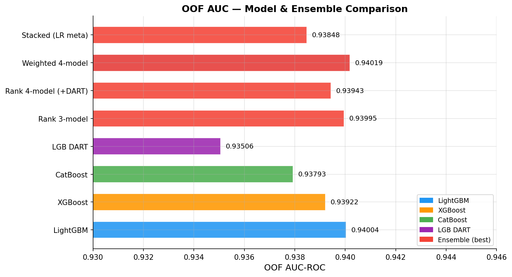
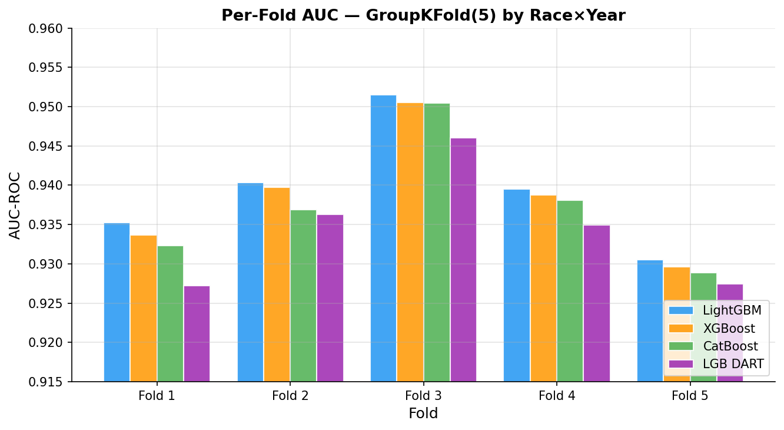
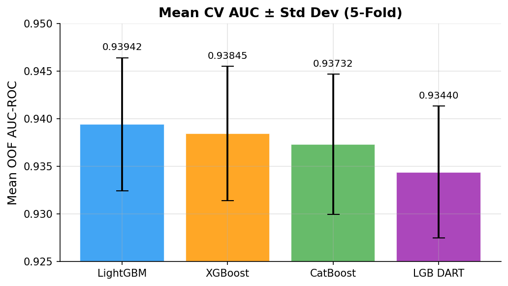

# Predicting F1 Pit Stops

**Kaggle Playground Series S6E5** — Binary classification: predict whether an F1 driver will pit on the next lap.  
Metric: **AUC-ROC** · [Competition link](https://www.kaggle.com/competitions/playground-series-s6e5/overview)

---

## Results

### Final OOF AUC — All Models & Ensembles

| Model / Ensemble | OOF AUC |
| --- | --- |
| LightGBM (tuned) | 0.94004 |
| XGBoost (tuned) | 0.93922 |
| CatBoost (tuned) | 0.93793 |
| LGB DART | 0.93506 |
| Rank 3-model (LGB + XGB + CAT) | 0.93995 |
| Rank 4-model (+ DART) | 0.93943 |
| Stacked (LR meta-learner) | 0.93848 |
| **Weighted 4-model blend** | **0.94019** |

Optimal ensemble weights: LGB=0.724 · XGB=0.105 · CAT=0.171 · DART=0.000

> Baseline OOF AUC without external dataset: ~0.930. Adding 76,929 deduplicated rows from the external F1 strategy dataset is the single biggest boost (+0.010).



### Per-Fold CV Results (GroupKFold-5 by Race×Year)

| Fold | LightGBM | XGBoost | CatBoost | LGB DART |
| --- | --- | --- | --- | --- |
| 1 | 0.93526 | 0.93366 | 0.93234 | 0.92724 |
| 2 | 0.94033 | 0.93972 | 0.93687 | 0.93631 |
| 3 | 0.95148 | 0.95051 | 0.95046 | 0.94606 |
| 4 | 0.93951 | 0.93875 | 0.93805 | 0.93492 |
| 5 | 0.93051 | 0.92962 | 0.92889 | 0.92748 |
| **Mean** | **0.93942** | **0.93845** | **0.93732** | **0.93440** |
| Std | 0.00697 | 0.00704 | 0.00734 | 0.00692 |





---

## Approach

### 1 · Key Findings from EDA

- **2023 anomaly**: 2023 data has a ~1% positive rate vs ~27% in other years — a synthetic generation artifact. `is_year2023` is the most impactful feature by SHAP (mean |SHAP| = 1.178).
- **Train/test share races**: rows are lap-level splits of the same races, so GroupKFold by Race×Year is required to prevent within-race leakage.
- **External dataset overlap**: 24,442 of 101,371 external rows duplicate training rows — deduplicated before use.

### 2 · Feature Engineering (45 features)

Features are computed on a combined train + test + external frame (sorted by Driver/Race/Year/Lap) to allow correct lag and rolling window computation.

| Group | Features |
| --- | --- |
| **Lag** | `LT_lag1/2`, `LTD_lag1`, `TL_lag1`, `PitStop_lag1`, `CD_lag1` |
| **Rolling** | `LT_roll3_mean/std`, `LT_roll5_std`, `LTD_roll3_mean`, `CD_roll3_mean` |
| **Stint** | `NormTyreLife`, `TyreLife_compound_pct`, `tyre_life_vs_field_max`, `Deg_per_lap` |
| **Degradation** | `deg_acceleration` (Δ wear per lap) |
| **Race context** | `EstTotalLaps`, `LapsRemaining`, `LT_race_compound_mean`, `LT_vs_pace` |
| **Interactions** | `LR_x_TL`, `TL_x_Stint`, `RP_x_TL`, `LT_acceleration`, `Deg_x_NormTL`, `LapsRemaining_x_NormTL` |
| **Strategic window** | `laps_rem_vs_compound_max`, `can_finish_on_current` |
| **Flags** | `is_year2023`, `is_pretesting`, `is_real_driver`, `Compound_ord` |
| **Target encodings** | `Driver_TE`, `Race_TE`, `Race_Year_TE` (OOF, computed inside CV folds) |

**SHAP insight**: `Stint` is rank-2 by mean |SHAP| (0.769) but absent from LGB gain importance top-20 — trees split on it slowly. The two strategic window features give the model cleaner decision boundaries.

### 3 · Cross-Validation

`GroupKFold(n_splits=5)` grouped by `Race_Year`. For each fold, the training set is the fold's train rows **plus all external rows** (weighted at 0.8 to account for the different driver encoding scheme).

### 4 · Models

- **LightGBM** — primary model; handles NaN natively, fastest iteration
- **XGBoost** — diversity through different tree construction algorithm
- **CatBoost** — symmetric trees add further ensemble diversity
- **LGB DART** — dropout regularisation, typically +0.001–0.002 over standard DART
- **Hyperparameter tuning**: Optuna TPE sampler, 3-fold CV during search (fast), then 5-fold with best params

### 5 · Ensemble

1. **Rank-average blend** — convert each model's scores to percentile ranks then average (normalises calibration differences between models)
2. **Optimised weighted blend** — `scipy.optimize.minimize` on OOF AUC
3. **Stacking** — logistic regression meta-learner trained on OOF predictions using GroupKFold
4. **Pseudo-labeling** — high-confidence test rows (prob > 0.90 or < 0.05) added to training at weight 0.5; only applied if OOF AUC improves

---

## Project Structure

```text
Predicting-F1-Pit-Stops/
├── notebooks/
│   └── predicting-f1-pit-stops-playground-series-s6e5.ipynb  ← self-contained Kaggle notebook
├── scripts/
│   └── generate_result_charts.py   ← generates outputs/ charts from final results
├── outputs/
│   ├── ensemble_comparison.png
│   ├── fold_auc_comparison.png
│   ├── mean_cv_auc.png
│   └── shap_summary.png
├── Dataset/                        ← raw data (gitignored)
├── submissions/                    ← generated CSVs (gitignored)
└── requirements.txt
```

---

## Reproducing Results

Upload `notebooks/predicting-f1-pit-stops-playground-series-s6e5.ipynb` to Kaggle and add the following datasets:

1. **Competition data** — [Playground Series S6E5](https://www.kaggle.com/competitions/playground-series-s6e5/data)
2. **External supplement** — search Kaggle Datasets for `f1-strategy-dataset` by aadigupta1601

The notebook is fully self-contained: feature engineering → Optuna tuning → 5-fold CV → ensemble → submission.csv.

**Estimated runtime**: ~3–4 hours on a Kaggle P100 GPU (most time is Optuna tuning; set `RUN_OPTUNA = False` to skip and use the pre-set params, reducing runtime to ~30 min with ~0.003–0.005 AUC penalty).

---

## Dataset

| File | Rows | Description |
| --- | --- | --- |
| `train.csv` | 439,140 | Labeled lap-level telemetry |
| `test.csv` | 188,165 | Unlabeled test rows |
| `f1_strategy_dataset_v4.csv` | 101,371 (76,929 unique) | External supplement — [source](https://www.kaggle.com/datasets/aadigupta1601/f1-strategy-dataset-pit-stop-prediction) |

All data lives in `Dataset/` (gitignored). Download from the [Kaggle competition page](https://www.kaggle.com/competitions/playground-series-s6e5/data).
